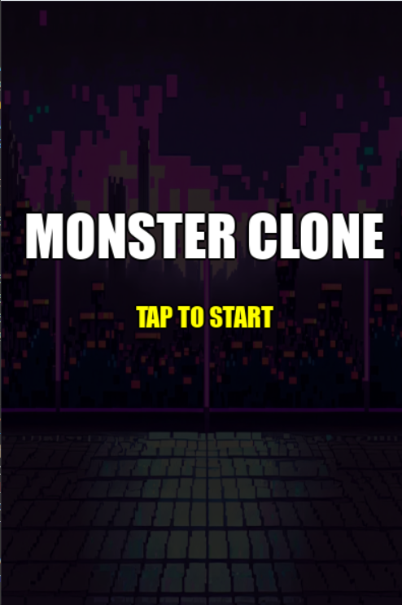
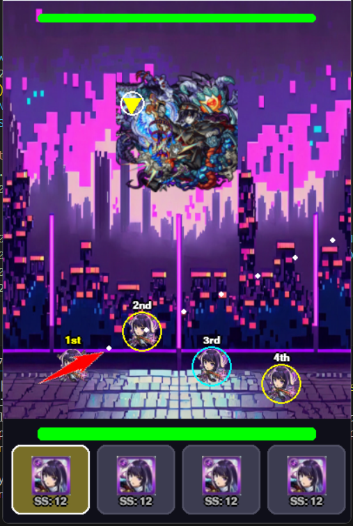
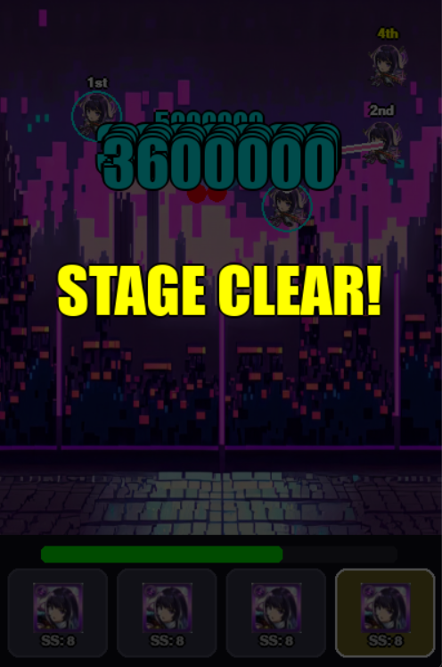
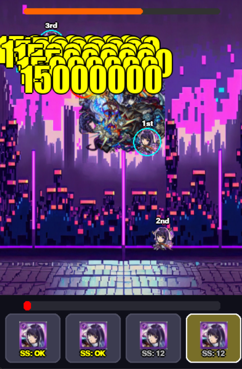

2025/12~2026/1  制作     制作時間28時間
---プレイ方法---
キャラにカーソルを合わせ、飛ばしたい方向と逆の方向に引っ張って離すとキャラが動きます。
敵のHPを削り切ったらクリアです。
12ターン経過でSS(ストライクショット)という必殺がたまります。キャラのアイコンをクリックすると使用することができます。
必殺の効果は最初に触れた敵に20発のダメージを与え、その後再度動き出すというものです。うまく使いこなしてね！
敵の周りをまわっている黄色い三角は敵の弱点です。そこに攻撃をあてると3倍のダメージが入ります。
味方に触れると友情コンボという攻撃がでて、レーザーとホーミング弾がでます。こちらも弱点の倍率が乗ります。

---クリアの勧め---
SSの使いどころと友情コンボの出すタイミング、弱点にうまく当てるといったことを意識するとクリアしやすいです！

---あとがき---
今回この作品を作るうえで工夫した点としては、友情コンボの再現です。
ホーミングとレーザーという２つの友情を実装しましたが、ホーミングを実装するうえでバラけて敵に飛ぶという挙動の実装に少し手こずりました。
また、SSの実装の際に再走の仕様と乱打の仕様を組み合わせる際、乱打後の再送で敵にめり込んだ際に敵のHPが一瞬で削れるといった不具合が多く
とても苦戦したのが印象に残っています。
ただ、一つ「これ、いいのかなー」と思ったことは、モンストのキャラクターをテクスチャとして使用してしまったことです。
言い訳をするとモンストのゲーム感に合うフリー素材がみつからなかったため、またこれをリメイクしていくときには、
自身で素材を作ったり、もっと探してみたいと思った。

